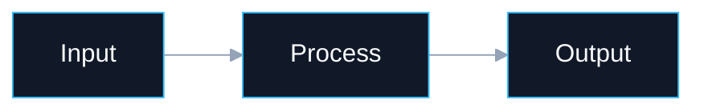
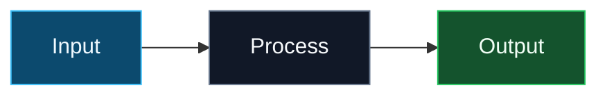
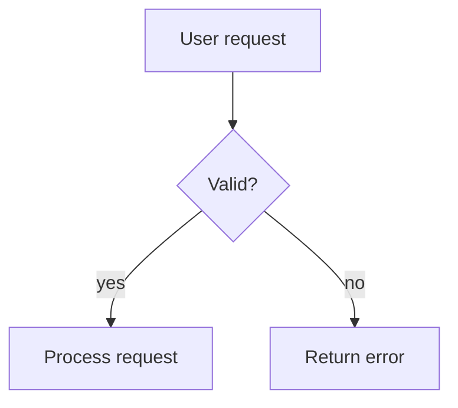
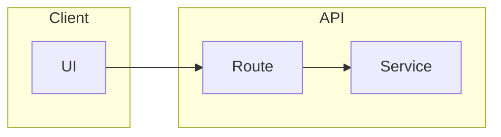
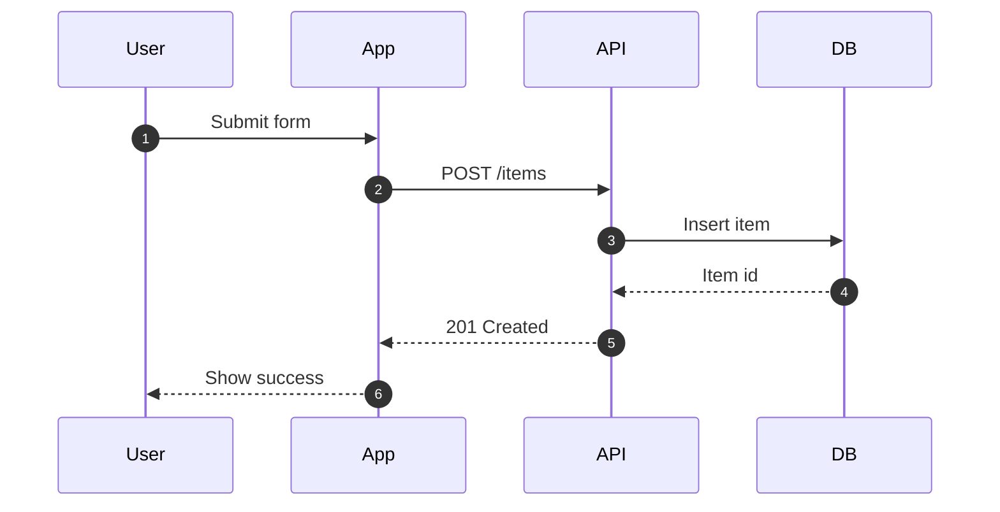
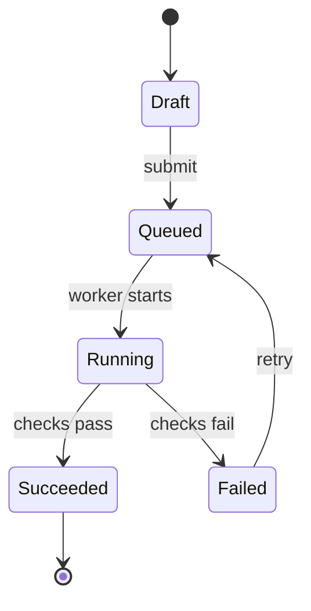

# Mermaid Theme And Syntax Reference

Use this reference for dark theme snippets, chart-specific review, and Mermaid configuration. Verify renderer support before using newer syntax.

## Contents

- [Portable Dark Theme](#portable-dark-theme)
- [Palette Guidance](#palette-guidance)
- [Flowchart Patterns](#flowchart-patterns)
- [Sequence Patterns](#sequence-patterns)
- [State And Lifecycle Patterns](#state-and-lifecycle-patterns)
- [Review Checklist](#review-checklist)

## Portable Dark Theme

Use `theme: base` when the renderer accepts frontmatter config:

When frontmatter config is not supported, keep the diagram valid with `classDef`:

## Palette Guidance

- Background: `#0b1020`
- Panel fill: `#111827`
- Neutral border: `#64748b`
- Text: `#f8fafc`
- Info: fill `#0c4a6e`, stroke `#38bdf8`
- Success: fill `#14532d`, stroke `#22c55e`
- Warning: fill `#713f12`, stroke `#f59e0b`
- Danger: fill `#7f1d1d`, stroke `#ef4444`
- External: fill `#312e81`, stroke `#a78bfa`

Do not assign every node a different hue. Use color to identify status, ownership, trust boundary, or risk.

## Flowchart Patterns

Use stable IDs and quoted labels:

For complex systems, use subgraphs:

Use edge labels only when they add meaning. Dense edge labeling makes diagrams harder to scan.

## Sequence Patterns

Use sequence diagrams for call order, not architecture maps:

Use `alt`, `opt`, `par`, and `loop` sparingly. If every branch needs multiple nested blocks, consider a flowchart plus a separate sequence for the important path.

## State And Lifecycle Patterns

Use state diagrams when the main question is "what states can this thing be in?"

## Review Checklist

- Does the chart type match the information shape?
- Does the renderer support every diagram feature used?
- Are labels short enough to read without zooming?
- Are IDs stable and separate from visible labels?
- Are class names and colors semantic rather than decorative?
- Does the diagram avoid color-only meaning?
- Does the dark theme have sufficient text and line contrast?
- Are subgraphs used to reduce crossings, not to add visual noise?
- Was the diagram rendered or syntax-checked when visual correctness matters?
